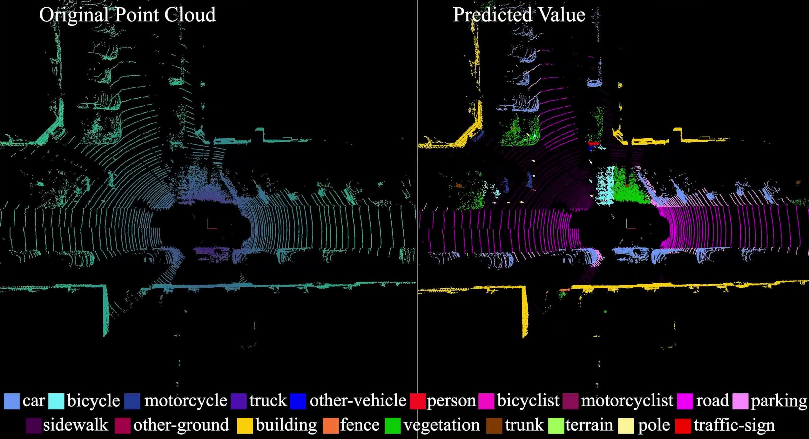

# MDSLCA

Official PyTorch implementation of [MDSLCA: Multi-scale Dilated Spatial and Local Channel Attention for LiDAR Point Cloud Semantic Segmentation](https://doi.org/10.1109/TCSVT.2026.3662054)


### [https://www.youtube.com/watch?v=C0QQHhWEoAA](https://www.youtube.com/watch?v=C0QQHhWEoAA)

[](https://www.youtube.com/watch?v=C0QQHhWEoAA "")


## Updates

- **(2026-02-06)** 🔥 Our MDSLCA is accepted by [TCSVT](https://doi.org/10.1109/TCSVT.2026.3662054). 

- **(2025-05-13)** 🔥 We release the code and model of our MDSLCA.

- **(2025-05-13)** 🏆 Our MDSLCA ranks first on [SemanticKITTI dataset](https://paperswithcode.com/sota/3d-semantic-segmentation-on-semantickitti).


## Experimental Results

### 3D Semantic Segmentation on SemanticKITTI test set

| Model | Modality | mIoU | Acc |  Log |
|:-----------:|:---------:|:-------:|:----------:|:--------:|
| MDSLCA18 (Ours) |    LiDAR     |    70.7%     | 91.3% | [MDSLCA18-test.txt](https://github.com/jinzhengguang/MDSLCA/blob/main/doc/MDSLCA18-test.txt) 
| MDSLCA34 (Ours) |    LiDAR     |    73.7%     | 92.0% | [MDSLCA34-test.txt](https://github.com/jinzhengguang/MDSLCA/blob/main/doc/MDSLCA34-test.txt) 

### 3D Semantic Segmentation on SemanticKITTI validation set

| Model | Modality | mIoU | Acc | Checkpoint |  Log |
|:-----------:|:---------:|:-------:|:----------:|:--------:|:--------:|
| MDSLCA18 (Ours) |    LiDAR     |    67.03%     | 92.48% | [MDSLCA18.pth](https://github.com/jinzhengguang/MDSLCA/releases/download/v1.0/MDSLCA18.pth) | [MDSLCA18.txt](https://github.com/jinzhengguang/MDSLCA/blob/main/doc/MDSLCA18.txt) 
| MDSLCA34 (Ours) |    LiDAR     |    71.75%     | 93.13% |  [MDSLCA34.pth](https://github.com/jinzhengguang/MDSLCA/releases/download/v1.0/MDSLCA34.pth)  | [MDSLCA34.txt](https://github.com/jinzhengguang/MDSLCA/blob/main/doc/MDSLCA34.txt) 


## Requirements

- `python>=3.10`
- `PyTorch>=2.1.2`
- `Cuda>=11.8`
- `mmcv>=2.1.0`
- `mmdet>=3.2.0`

### Installation

```shell
python setup.py develop
```


## SemanticKITTI dataset

Download [SemanticKITTI dataset](http://semantic-kitti.org/dataset.html#download) under `PROJECT/data/semantickitti`.

The folder structure should be organized as follows before our processing.

```
MDSLCA
├── configs
├── images
├── mmdet3d
├── tools
├── data
│   ├── semantickitti
│   │   ├── sequences
│   │   │   ├── 00
│   │   │   │   ├── labels
│   │   │   │   ├── velodyne
│   │   │   ├── 01
│   │   │   ├── ..
│   │   │   ├── 22
```

Dataset Preparation

```shell
python ./tools/create_data.py semantickitti --root-path ./data/semantickitti --out-dir ./data/semantickitti --extra-tag semantickitti
```


## Model Training and Inference

### Training

If you want to train our MDSLCA network for 3D Semantic Segmentation with 4 GPUs, please run:

```shell
./tools/dist_train.sh MDSLCA/configs/MDSLCA.py 4
```

### Evaluation

We also provide instructions for evaluating our pretrained models with 4 GPUs. Please download the checkpoints using the following script:

```shell
./tools/dist_test.sh MDSLCA/configs/MDSLCA.py MDSLCA.pth 4
```


## Citation

```
@article{guang2026mdslca,
  author={Guang, Jinzheng and Zhang, Qianyi and Liu, Jingtai},
  journal={IEEE Transactions on Circuits and Systems for Video Technology}, 
  title={MDSLCA: Multi-scale Dilated Spatial and Local Channel Attention for LiDAR Point Cloud Semantic Segmentation}, 
  year={2026},
  volume={},
  number={},
  pages={1-15},
  doi={10.1109/TCSVT.2026.3662054}
}
```

## Acknowledgement

- Point Transformer [(link)](https://github.com/Pointcept/Pointcept)
- DCCLA [(link)](https://github.com/jinzhengguang/DCCLA)
- MMDetection3D [(link)](https://github.com/open-mmlab/mmdetection3d)


## Contact Information

If you have any suggestion or question, you can leave a message here or contact us directly: guangjinzheng@qq.com. Thanks for your attention!
